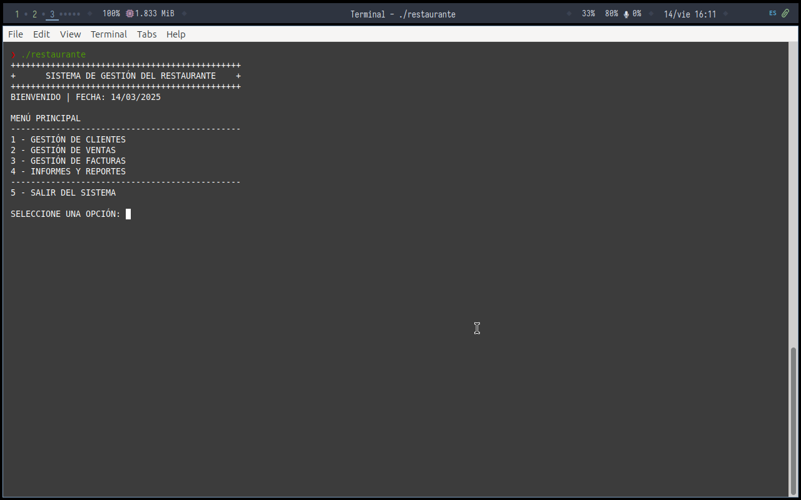
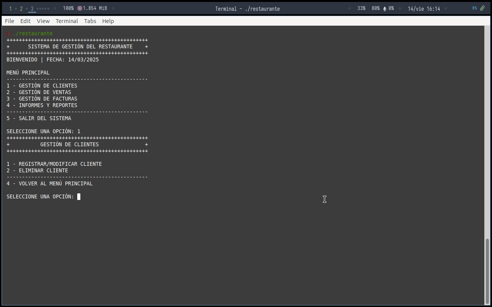
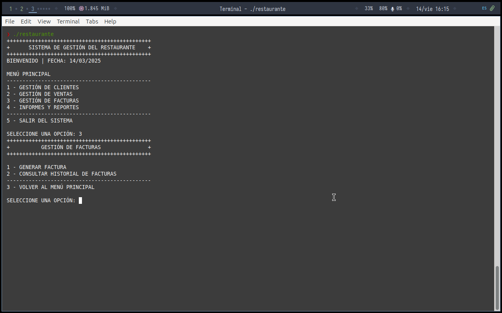

# Sistema de Gestión Comercial en COBOL - UNA


##


## 📋 Descripción Completa
<details open>
<summary>Ver detalles</summary>

Sistema desarrollado como **Trabajo Práctico** para la asignatura **Procesamiento de Datos (Código 330)** de la **Universidad Nacional Abierta**. Implementa un sistema completo de gestión comercial con:

- **Gestión de clientes** (CRUD completo)
- **Registro de ventas** (asociación con facturas)
- **Generación de facturas** (cálculo automático de IVA)
- **Reportes mensuales** (estadísticas y resúmenes)

Desarrollado en **COBOL** usando **GnuCOBOL 3.1.2.0** con organización de archivos **secuenciales indexados**.
</details>

## 🗂️ Tabla de Contenidos
- [Instalación](#-instalación)
- [Uso](#-uso)
- [Características](#-características)
- [Estructura del Proyecto](#-estructura-del-proyecto)
- [Ejemplos](#-ejemplos)
- [Versiones Testeadas](#-versiones-testeadas)
- [Licencia](#-licencia)
- [Autor](#-autor)

## 💻 Instalación
<details open>
<summary>Requisitos y pasos</summary>

### Requisitos previos
- GnuCOBOL 3.1.2+
- Sistema Linux (probado en Ubuntu 20.04)

### Pasos de instalación
```bash
# 1. Clonar repositorio
git clone https://github.com/tu-usuario/gestion-comercial-cobol-330UNA.git

# 2. Compilar
cobc -x -O -o restaurante.cbl

# 3. Ejecutar
./restaurante
```
</details>

## 🖥️ Uso
<details open>
<summary>Flujo principal</summary>

1. **Menú principal** con 4 opciones:
   - Gestión de clientes
   - Gestión de ventas
   - Facturación
   - Reportes

2. Cada módulo permite:
   - Crear nuevos registros
   - Modificar existentes
   - Eliminar entradas
   - Generar reportes

3. Los datos se persisten en archivos `.TXT` en la carpeta `data/`
</details>

## ✨ Características
<details>
<summary>Ver todas las funcionalidades</summary>

### Gestión de Clientes

- Registro con RIF, nombre y datos de contacto
- Validación de formatos
- Búsqueda por RIF

### Facturación Automática

- Generación con numeración consecutiva
- Cálculo automático de IVA
- Asociación con ventas

### Reportes Mensuales

1. Listado de clientes
2. Facturas por período
3. Resumen estadístico
</details>

## 📝 Ejemplos
<details>
<summary>Código destacado</summary>

### Estructura de datos
```cobol
01 CLIENTE-REG.
   05 CLIENTE-RIF       PIC X(10).
   05 CLIENTE-RAZON     PIC X(50).
   05 CLIENTE-TELEFONO  PIC X(15).
```

### Menú principal
```
++++++++++++++++++++++++++
+ SISTEMA COMERCIAL COBOL +
++++++++++++++++++++++++++
1. Gestión Clientes
2. Registro Ventas
3. Facturación
4. Reportes
5. Salir
Seleccione opción: 
```
</details>

## ✔️ Versiones Testeadas
<details>
<summary>Entornos verificados</summary>

- **GnuCOBOL**: 3.1.2
- **Sistemas Operativos**:
  - Ubuntu 20.04 LTS
  - Debian 10
- **Hardware**:
  - x86_64 architecture
  - Requiere 50MB de almacenamiento
</details>

## 📜 Licencia
MIT License - Ver [LICENSE](LICENSE) para detalles completos.

## 👨‍💻 Autor
**Yordis Cujar**  
Estudiante de Ingeniería de Sistemas - UNA  
🔗 [LinkedIn](https://linkedin.com/in/yordiscujar)  

---